## Home Sentinel - IoT Package

This repository contains the core systems developed for the Home Sentinel security platform.
Home Sentinel is a project developed by third-year Computer Science students at São Paulo Tech School

---

### What is Home Sentinel?
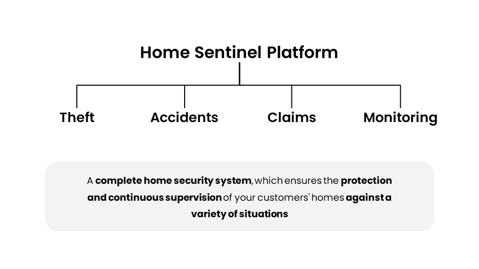

--- 
### Why are we in this business?
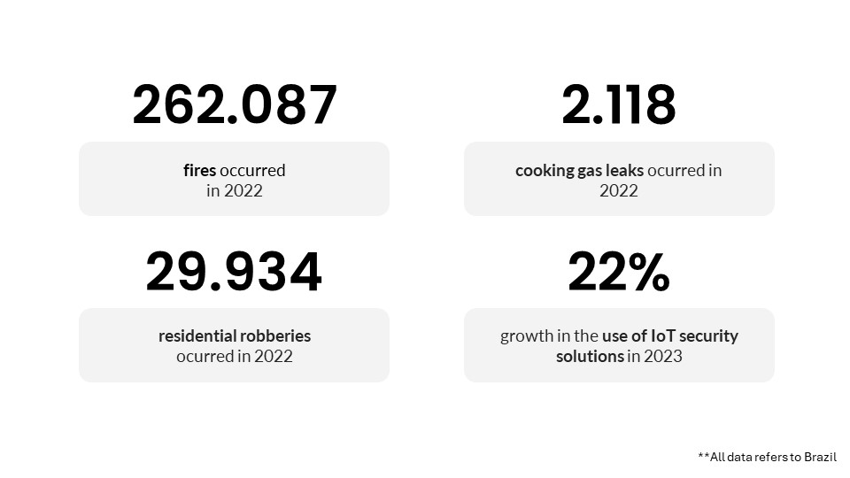

---
### How does it work?
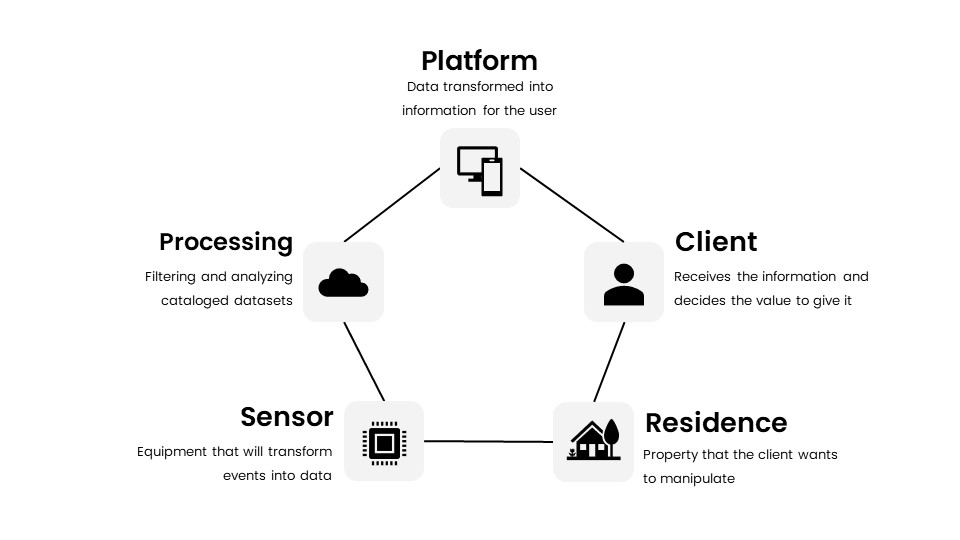

---
### What sensors are we using?
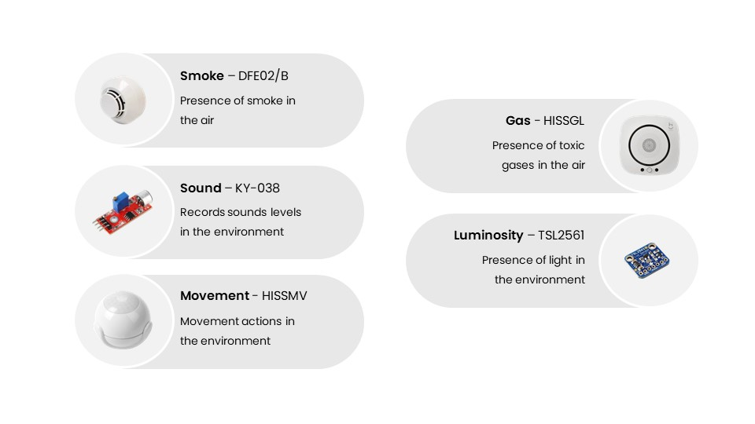

---
### Project Overview
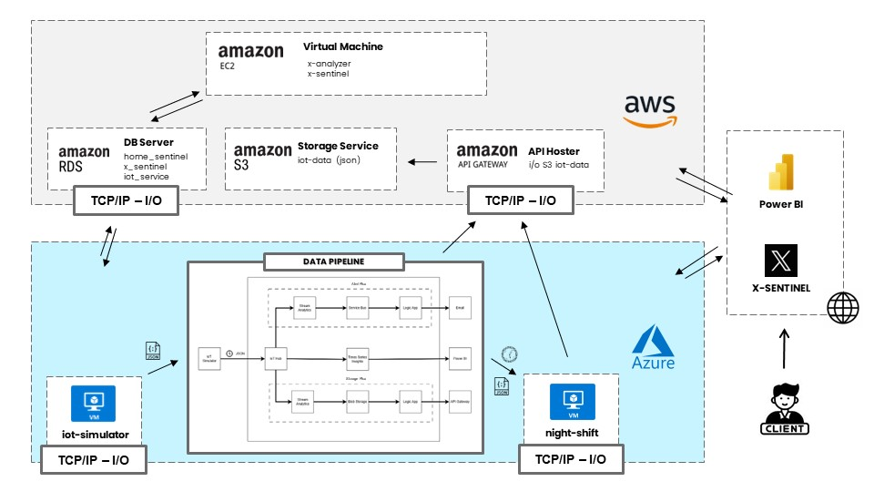

The data is generated by the iot-simulator (provisioned in a Virtual Machine on Azure), which connects via HTTP protocol with the Azure IoT Hub, sending a file that contains measurements structured in JSON. Each file contains the sensor ID, the value, the date and time, and which model generated each value. This data can be generated and sent at configurable intervals in the iot-simulator.

Through the Azure IoT Hub, a data pipeline is triggered through which the generated data must pass. First, the data pipeline destructures this JSON and reads each measurement individually. Through the sensor model, it is possible to observe if there is any value that deviates from the predefined settings (via RDS database). This entire stage is executed by Stream Analytics. If there is a deviation, a notification flow is activated to send a notification to the sensor owner.

This data is kept in memory on Azure, waiting for about 24 hours. Meanwhile, each new set of data received and passed through the alert flow is merged so that, in the end, it becomes just one to be stored.

The second stage consists of temporarily storing this file in Azure's storage service, Blob Storage, and attempting to send this file to the S3 storage service via an endpoint on the API Gateway, in the AWS provisioning.

As soon as the file upload is completed to S3, it is deleted from Blob Storage, and a request is sent to the Night-shift application. This application is responsible for processing the data for final storage. Through it, the data redundancy is reduced (saving storage space), KPIs are created, a statistical study is conducted, and the data is tabularized to be hosted in a relational database, aiming to feed the Power BI data model, which will be accessed by the client.

Simultaneously with this data processing, the x-analyzer application scans the social network X (formerly Twitter), relating keywords about security and crime with the geolocation of our clients. It captures tweets related to the location and, through a sentiment analyzer, we can also capture the sentiment expressed by the tweet's author about the published content. This way, we can map which clients live in higher-risk areas and are subject to more severe losses. This can also be used for a possible marketing plan or some internal business decision.

The data captured by the x-analyzer also feeds a word cloud on the Power BI dashboard. This cataloged data feeds the x-sentinel platform, also hosted on an EC2 in AWS, which provides an internal company dashboard for decision-making.

Through this multicloud architecture, we were able to create a POC (proof of concept) of a digital company that monitors residences, seeking to protect the end client from property losses.

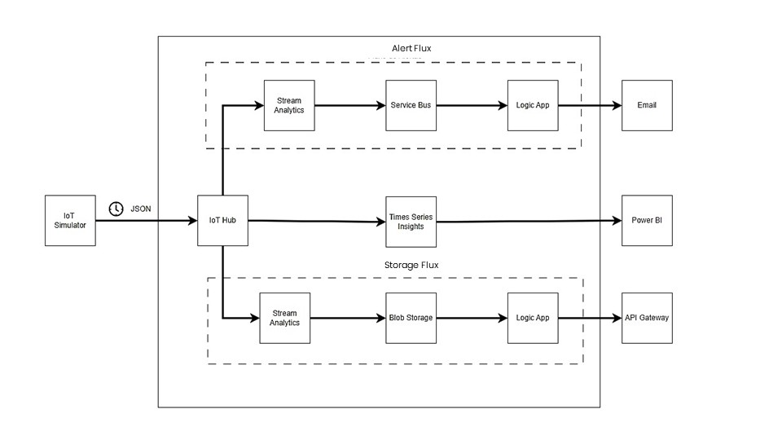

---
### Power BI

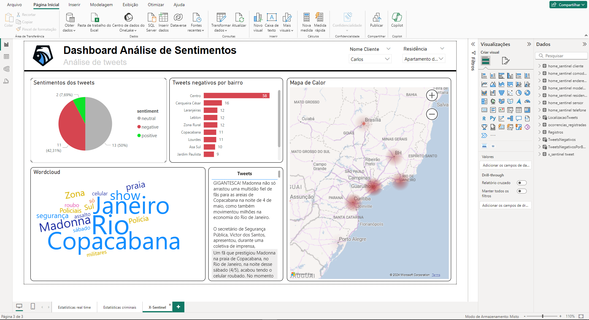

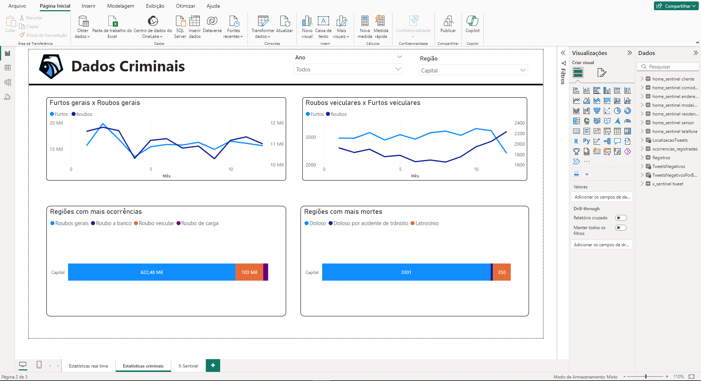

**Note:** The Power BI real-time statistics dashboard was not available at the time of printing this document.

---
### x-sentinel

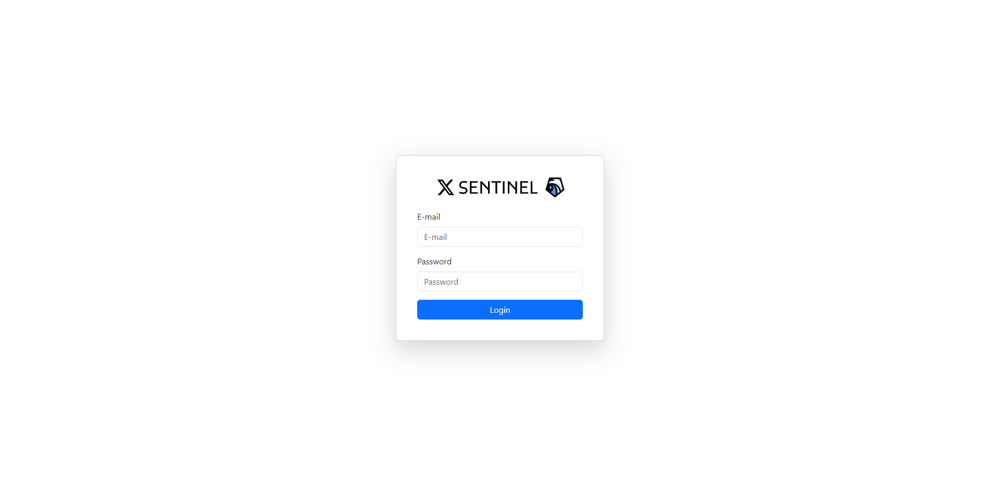

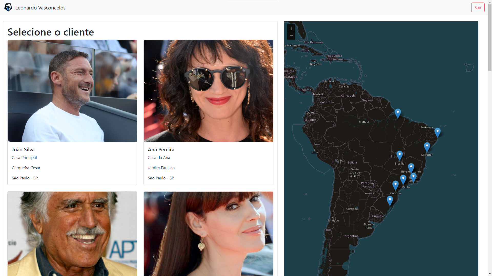

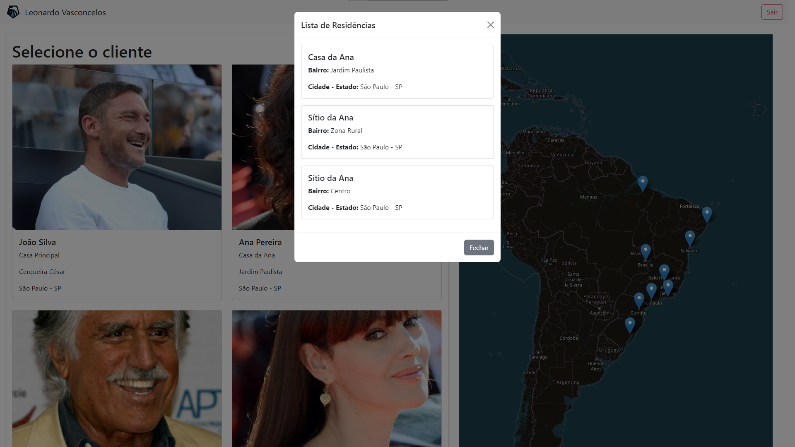

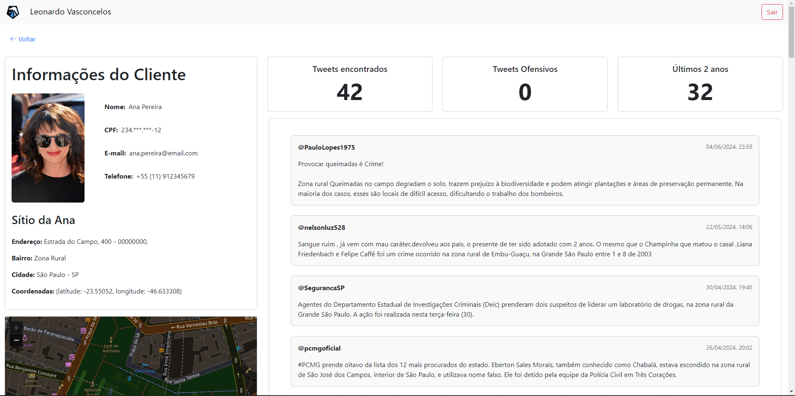

---
## Contributors

| Name                 | GitHub Username                                 | Photo                                                                 | Working at         |
| -------------------- | ----------------------------------------------- | --------------------------------------------------------------------- | ------------------ |
| Igor Tarquini        | [@IgorTarquini](https://github.com/IgorTarquini) |   | Motorola Solutions  |
| Kauan Cavazani       | [@KauanCavazani](https://github.com/KauanCavazani) |  | TIVIT  |
| Kelvin Gomes         | [@kelvinsync](https://github.com/kelvinsync)       |    | TIVIT  |
| Leonardo Vasconcelos | [@leovasc5](https://github.com/leovasc5)         |  | São Paulo Tech School  |
| Vinicius Cardoso     | [@ViniSCardoso](https://github.com/ViniSCardoso)   |  | Bradesco  |

---
### Companies
And a special thanks to the companies we work for and are supporting our development.
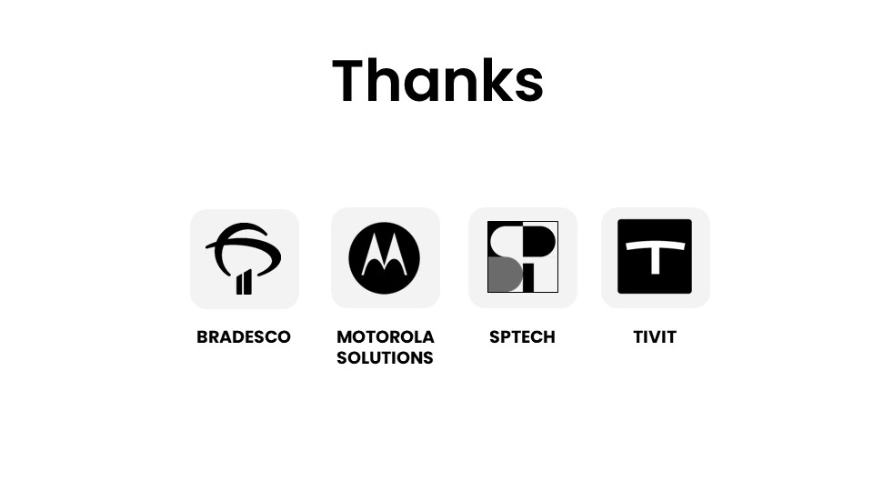